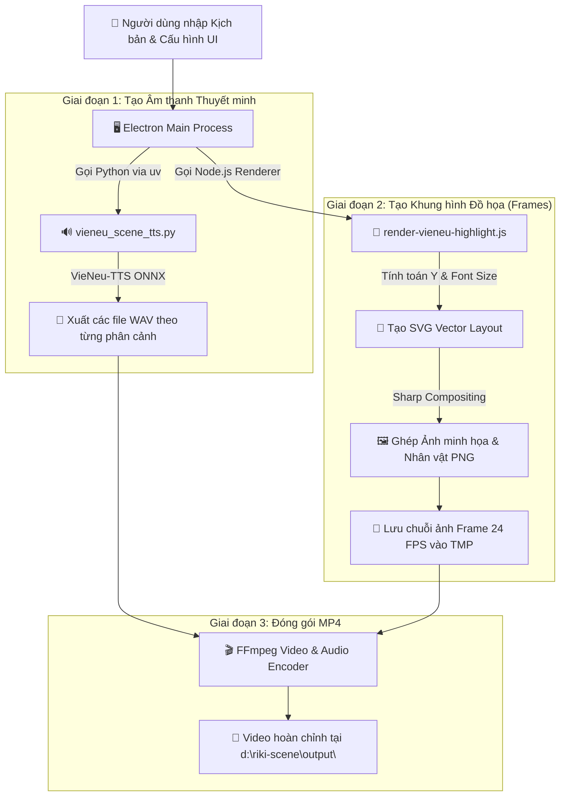

# 🎬 Riki Scene — Xưởng Tạo Video Ngắn Tự Động

**Riki Scene** là ứng dụng Desktop cross-platform (chạy trên cả **Windows** và **macOS**) hỗ trợ biên tập và kết xuất video ngắn dạng dọc (tỷ lệ chuẩn **9:16 - 1080x1920**) dùng cho Tiktok, Shorts, Reels. Ứng dụng tích hợp bộ đọc giọng nói tiếng Việt mượt mà chạy **offline hoàn toàn trên CPU (VieNeu-TTS ONNX)** mà không cần kết nối internet hay GPU đắt tiền.

---

## 🛠️ Tài nguyên & Thư viện Sử dụng

Ứng dụng được thiết kế theo kiến trúc khép kín **All-in-One**, không yêu cầu người dùng phải cài đặt riêng lẻ từng công cụ phụ trợ:

### 1. Khung ứng dụng & Giao diện (Frontend & Desktop App)
- **[Electron](https://www.electronjs.org/)**: Khung đóng gói ứng dụng Desktop cross-platform.
- **HTML5 & Vanilla CSS3**: Thiết kế hệ thống theo chuẩn BEM & SCSS Design Tokens (màu sắc HSL, hiệu ứng glassmorphism, responsive).
- **Vanilla JavaScript (ES6+)**: Xử lý logic giao diện, tương tác chuột (Pointer Events), phát thử âm thanh Web Audio.

### 2. Bộ máy Thuyết minh Tiếng Việt (TTS Engine)
- **[VieNeu-TTS](https://github.com/vie-neu/vieneu)**: Mô hình trí tuệ nhân tạo đọc giọng nói Tiếng Việt tự nhiên.
- **ONNX Runtime (CPU / int8)**: Tối ưu hóa mô hình AI đọc nhanh, tiêu tốn ít tài nguyên CPU.
- **[uv](https://github.com/astral-sh/uv)**: Trình quản lý môi trường Python siêu nhanh (tự động tích hợp trong thư mục `bin/`).

### 3. Bộ Kết xuất & Xử lý Đồ họa Video (Video Renderer)
- **[Sharp](https://sharp.pixelplumbing.com/)**: Thư viện xử lý ảnh đồ họa hiệu năng cực cao (ghép nhân vật, ảnh minh họa, vẽ SVG vector frame).
- **[FFmpeg Static](https://github.com/eugeneware/ffmpeg-static)**: Công cụ ghép nối danh sách ảnh frame (24 FPS) và lồng ghép file âm thanh WAV thành video MP4 hoàn chỉnh.

---

## 📐 Sơ đồ Luồng Hoạt động Vận hành (Operational Flow Diagram)

Dưới đây là sơ đồ luồng dữ liệu từ khi người dùng nhập kịch bản tới khi xuất ra file video `.mp4`:



---

## 📂 Cấu trúc Dự án (Project Structure)

```text
riki-scene/
├── bin/                       # Nơi chứa công cụ thực thi uv (Tự động tải về khi setup)
├── local-tts/
│   └── VieNeu-TTS/            # Engine VieNeu-TTS ONNX tiếng Việt
├── prototype-v4/              # Giao diện người dùng (UI Preview, CSS Styles, App Logic)
│   ├── index.html             # Màn hình chính ứng dụng
│   ├── styles.css             # Hệ thống CSS Design System
│   └── app.js                 # Logic biên soạn, preview & tính toán bố cục
├── renderer/                  # Bộ xử lý đồ họa & render video MP4
│   ├── render-vieneu-highlight.js # Engine kết xuất khung hình Sharp & FFmpeg
│   ├── vieneu_scene_tts.py    # Script Python gọi VieNeu-TTS sinh âm thanh
│   └── preview_voice.py       # Script Python tạo câu chào nghe thử giọng đọc
├── output/                    # Thư mục mặc định chứa các video .mp4 xuất ra
├── electron-main.js           # Tiến trình chính Electron (IPC Main Process)
├── preload.js                 # Cầu nối an toàn IPC Bridge між UI và Node.js
├── setup-binaries.js          # Script tự động cài đặt uv & môi trường TTS
├── start.bat                  # File tự động cài đặt & khởi chạy (Dành cho lần đầu)
├── start.command              # (Dành cho macOS)
├── run.bat                    # File khởi chạy nhanh ứng dụng (Cho các lần sau)
├── run.command                # (Dành cho macOS)
└── package.json               # Khai báo thư viện & các lệnh npm script
```

---

## 💻 Hướng dẫn Cài đặt & Sử dụng

> **Yêu cầu duy nhất**: Máy tính cần cài sẵn **Node.js (v18 trở lên)**.  
> Tải Node.js tại: [https://nodejs.org](https://nodejs.org)

### 🪟 Dành cho Windows

#### Cài đặt lần đầu (hoặc khi cần cài đặt lại)
Double-click vào file **`start.bat`** tại thư mục dự án. Cửa sổ terminal sẽ tự động cài đặt thư viện cần thiết và mở ứng dụng.

#### Khởi chạy nhanh (Cho các lần sử dụng tiếp theo)
Double-click trực tiếp vào file **`run.bat`** để khởi chạy ngay ứng dụng mà không cần qua các bước kiểm tra và cài đặt lại.

---

### 🍎 Dành cho macOS

#### Cài đặt lần đầu (hoặc khi cần cài đặt lại)
1. Lần đầu tiên mở dự án, cần cấp quyền thực thi cho file `start.command` trong Terminal:
   ```bash
   chmod +x start.command
   ```
2. Sau đó, double-click file **`start.command`** trong Finder để khởi chạy và tự động thiết lập.

#### Khởi chạy nhanh (Cho các lần sử dụng tiếp theo)
1. Cấp quyền thực thi cho file `run.command` trong Terminal:
   ```bash
   chmod +x run.command
   ```
2. Sau đó, double-click file **`run.command`** để khởi chạy ngay lập tức.

---

## ⚡ Các Tính năng Nổi bật Trong Ứng dụng

1. **Trình biên soạn trực quan**:
   - Nhập kịch bản (mỗi dòng = 1 cảnh).
   - Đổi màu từ so sánh vế trái / vế phải, chỉnh phông nền video.
   - Thêm / Xóa ảnh minh họa linh hoạt cho từng cảnh hoặc toàn bộ video.
2. **Kích thước chữ & Nhân vật tùy chỉnh linh hoạt**:
   - Ô tăng/giảm Cỡ chữ thuyết minh (`px`).
   - Ô tăng/giảm Kích thước nhân vật (`%`).
3. **Phân cảnh & Nhân vật (Poses)**:
   - Đặt tư thế cho nhân vật ở từng cảnh (Chỉ trái, Chỉ phải, Đặt câu hỏi, Giải thích, Phân tích, hoặc 🚫 Không dùng nhân vật).
4. **🔊 Nghe thử Giọng đọc mẫu (Voice Preview)**:
   - Nghe thử trực tiếp câu chào từ giọng đọc (Minh Đức, Phạm Tuyên, Trúc Ly, Ngọc Linh...) và phong cách (Tin tức, Tự nhiên, Đọc truyện) trước khi bấm tạo video.
5. **Xem trước 1:1 Chuẩn Video MP4**:
   - Khung xem trước điện thoại mô phỏng chính xác 100% tỷ lệ bố cục và vị trí hiển thị video xuất ra tại `d:\riki-scene\output\`.
